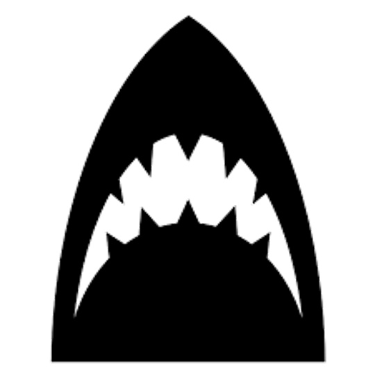

# Testing of long-range electric deterrents for reducing the risk of shark bite

- <strong>Madeline Riley</strong> (née Thiele), <a href="https://twitter.com/SouthernSharkEG">Southern Shark Ecology Group</a> & <a href="https://globalecologyflinders.com/">Global Ecology Lab</a>, Flinders University (<a href="mailto:madeline.thiele@flinders.edu.au">e-mail</a>)
- <strong>Charlie Huveneers</strong>, <a href="https://twitter.com/SouthernSharkEG">Southern Shark Ecology Group</a>, Flinders University (<a href="mailto:charlie.huveneers@flinders.edu.au">e-mail</a>)
- <strong>Corey J. A. Bradshaw</strong>, <a href="https://globalecologyflinders.com/">Global Ecology Lab</a>, Flinders University (<a href="mailto:corey.bradshaw@flinders.edu.au">e-mail</a>)

 
R code, data files, and references accompanying paper in review: 
 
Riley, M, CJA Bradshaw, C Huveneers. 2022. Long-range electric deterrents not as effective as personal deterrents for reducing risk of shark bite. <em>ICES Journal of Marine Science</em> In review

## Abstract
While personal electric deterrents can reduce the risk of shark bite, evidence for the efficacy of other products is limited. We assessed two versions of a novel electric deterrent — 80 volts (V) and 150 V — designed to protect a large area (8 m deep × 6 m wide) or to be linked together for greater spatial coverage. We did 116 experimental trials on 43 white sharks (<em>Carcharodon carcharias</em>) to assess: (a) percentage of baits taken, (b) distance between bait and shark, (c) number of passes, and (d) whether sharks reacted to the deterrent. The proportion of baits taken reduced by 24% (80 V) and 48% (150 V), although high variance of the effect coefficient precluded statistical differentiation. Only the 150-V deterrent increased the distance between bait and shark (control: 1.59 ± 0.28 m versus active deterrent: 3.33 ± 0.33 m), but both versions increased the likelihood of a reaction (average reaction distance: 1.88 ± 0.14 m). Results were similar whether we measured distance using stereo-cameras or estimated them in situ, suggesting that stereo-cameras might not be necessary to quantify distances between sharks and baits. Our findings provide more evidence that electric deterrents can reduce the risk of shark bite, but the restricted efficacy limits the suitability of this device.

## References
We also provide some PDF copies of relevant references cited in the paper (in the <a href="https://github.com/MadelineRiley95/Long-range-electric-deterrents-testing/tree/main/refs"><em>refs</em></a> folder):
- Chateauminois, E., Hoarau, M., and Maillard, F. 2019. <em><a href="https://github.com/MadelineRiley95/Long-range-electric-deterrents-testing/blob/main/refs/Innovative%20projects%20of%20the%20shark%20risk%20reduction%20resource%20and%20support%20center%20(CRA)-results%20of%20experimental%20tests%20on%20individual%20electrical%20impulse%20repulsion%20equipment-final%20report.pdf">Innovative projects of the shark risk reduction resource and support center (CRA)-results of experimental tests on individual electrical impulse repulsion equipment-final report</a></em>. 2.1.
- Huveneers, C, S Whitmarsh, M Thiele, L Meyer, A Fox, CJA Bradshaw. 2018. Effectiveness of five personal shark-bite deterrents for surfers. <em>PeerJ</em> 6: e5554. doi:<a href="http://doi.org/10.7717/peerj.5554">10.7717/peerj.5554</a> (see also relevant Github repository)
- Riley, MJ, P Meagher, C Huveneers, J Leto, VM Peddemors, D Slip, J West, CJA Bradshaw. 2022. The Australian Shark-Incident Database for quantifying temporal and spatial patterns of shark-human conflict. <em>Scientific Data</em> 9: 378. doi:<a href="http://doi.org/10.1038/s41597-022-01453-9">10.1038/s41597-022-01453-9</a> (see also relevant Github repository)
